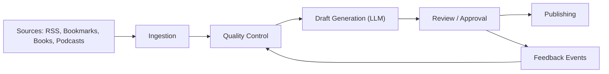
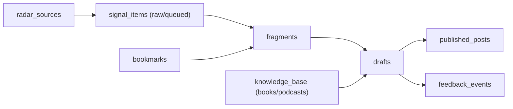

# SoundsLikeAI

**Autonomous content operating system for persona‑driven B2B teams.**  
Turn real inputs into credible drafts — fast, repeatable, and aligned to a persona’s voice.

## About
SoundsLikeAI helps teams publish consistently without sounding generic.  
It ingests real sources (RSS, bookmarks, books, podcasts), filters for relevance, and produces drafts tailored to a persona’s style.  
The goal is a daily loop: **collect → qualify → draft → review → publish**.

## System Overview


## Data Flow (Core Tables)


## Value in One Line
Collect signal‑quality inputs, turn them into persona‑aligned drafts, and ship faster than manual content ops.

## Architecture Rules
- One canonical data model.
- Database changes only via migrations.
- Schema contract enforced at startup and in CI.
- No runtime DDL.
- Clear boundaries: API, domain, services, workers.

## Schema Source of Truth
- Supabase SQL migrations in `supabase/migrations/` are the only authoritative schema.
- No Python/Alembic backend is used in this project.

## Quick Start (MVP)
1. Copy `.env.example` to `.env` and fill in Supabase plus one LLM key.
2. Install deps: `npm install`.
3. Validate schema: `npm run schema:guard`.
4. Seed a profile: `npm run seed:profile` (set `SEED_*` values first).
5. Run the API: `npm run dev -- --filter @sla/bot`.
6. Open the web console at [http://localhost:3001/ui](http://localhost:3001/ui).

Ingest a text fragment:
```bash
curl -X POST http://localhost:3001/ingest \
  -H "Content-Type: application/json" \
  -H "x-api-key: $API_KEY" \
  -d '{
    "user_id": "<profile-uuid>",
    "type": "text",
    "raw_content": "Draft me a post about today’s launch."
  }'
```

Fetch drafts:
```bash
curl "http://localhost:3001/drafts?user_id=<profile-uuid>" \
  -H "x-api-key: $API_KEY"
```

Telegram is optional. To enable it, set `TELEGRAM_BOT_TOKEN` and `TELEGRAM_BOT_DISABLED=false`.

## Environment (LLM)
```
GROQ_API_KEY=
GEMINI_API_KEY=
GEMINI_API_KEYS=
GEMINI_MODEL=gemini-2.5-flash
MISTRAL_API_KEY=
OPENROUTER_API_KEY=
```

## Knowledge Ingestion (Books + Podcasts)
Books (PDF or text file):
```bash
npm run ingest:book -- --file /path/to/book.pdf --title "Book Title" --author "Author Name"
```

Podcasts (RSS feed + Whisper):
```bash
npm run ingest:podcast -- --feed "https://lexfridman.com/feed/podcast/" --name "Lex Fridman Podcast" --episodes 2
```

Requirements:
- `EMBEDDINGS_SERVICE_URL` must be set.
- `WHISPER_SERVICE_URL` must be set for podcasts.

## Radar Controls (Env)
```
RADAR_MAX_ITEMS=3
RADAR_SCORE_THRESHOLD=75
RADAR_REQUIRE_EMBEDDINGS=true
RADAR_QUEUE_ONLY=true
RADAR_REQUIRE_KEYWORDS=true
RADAR_KEYWORDS=automation,ops,operations,devops,revops,sales ops,support ops,customer success,sales,revenue,workflow,integration,api,sync,pipeline,deployment,release,ci/cd,cicd,incident,reliability,sre,observability,monitoring,logging,on-call,runbook,infrastructure,platform,architecture,migration,cloud,security,compliance,audit,governance,identity,access,sso,auth,network,data,internal tool,backoffice,ticketing,crm,erp,billing,procurement,b2b,saas,ai agent,agentic,onboarding,data sync,manual process,automation platform,productivity,автоматизация,операции,продажи,внедрение,процессы
RADAR_EMPTY_VOICE_SCORE=80
RADAR_NO_EMBEDDINGS_SCORE=80
RADAR_MAX_DRAFTS_PER_RUN=10
RADAR_SKIP_DRAFTS=false
INGESTION_NO_DRAFTS=true
QC_MAX_ITEMS=50
QC_SCORE_THRESHOLD=60
DRAFT_MAX_ITEMS=10
```

## Repo Structure
- `apps/bot/`: Telegram bot + Hono API
- `packages/*`: shared packages (db, ai, pipeline, scrapers, publisher)
- `trigger/`: Trigger.dev jobs
- `docs/`: specs and project management

## Roadmap Snapshot
- Close one full loop: **signal → draft → review → publish**
- Harden QC so only high‑signal items reach drafting
- Expand sources and automate scheduling

## Docs
- `docs/BACKEND_BUILD.md`
- `docs/SCRAPERS_TOOLS.md`
- `docs/PROJECT_MANAGEMENT.md`
